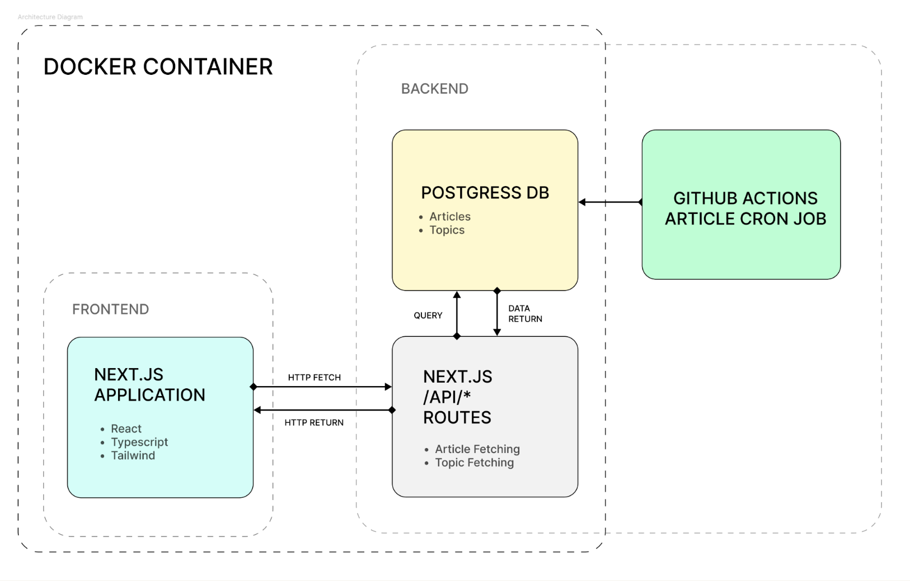

# Hyper Recent Technical Documentation

Hyper Recent is a website that provides users with the latest biomecial publications and updates in real-time. The following document explains the technical details, architecture, infrastructure, and tooling required to deploy the application.

## Software Architecture

### Frontend

Tech Stack:
- Framework: Next.js (React Framework)
- Language: TypeScript
- Styling: Tailwind CSS

Overview:
- Next.js provides enhanced React functionality including routing and data handling capabilities.
- TypeScript ensures cleaner, bug-free code through strict type checking.
- Tailwind CSS simplifies styling by allowing CSS classes to be written directly in HTML, keeping styles and markup together for easier maintenance.

### Backend

Tech Stack:
- Framework: Next.js (React Framework)
- Database: PostgreSQL
- ORM: Prisma

Overview:
- Next.js handles API routing and server-side logic, primarily focusing on handling API endpoints for retrieving and filtering research papers.
- PostgreSQL provides reliable storage and querying for metadata, enabling efficient management of scientific research papers, including topics, authors, and their relationships.
- Prisma acts as a bridge between our Next.js application and PostgreSQL database, allowing type-safe database queries and automated schema management.

### Architecture Diagram

  

The diagram illustrates that the Next.js frontend communicates with the backend tier of the same application. The backend processes these requests and interacts with a PostgreSQL relational database to manage data. To ensure the database remains up-to-date, GitHub Actions or cron jobs are scheduled to perform daily updates. This architecture allows data updates to occur seamlessly in the background without causing any downtime for the application.

## Getting Started

For future development, users can [fork the repository](https://github.com/csc301-2024-f/project-17-computational-bio-lab-ccbr/fork) and continue developing directly from the main branch of the forked repository. We have included recommended instructions for GitHub usage [below](#publishing-a-release-and-cicd), including sections on creating releases, managing branches, and GitHub Actions. Alternatively, the code can also be downloaded and uploaded to a separate repository without necessitating a fork. Forking is generally recommended if users want to push changes back to the parent repository.

Once a repository is set up, users can [clone the repository](https://docs.github.com/en/repositories/creating-and-managing-repositories/cloning-a-repository) to any Windows, Mac, or Linux machine to get started.

## Required software

- [Node.js](https://nodejs.org/en/) >=14
- [PostgreSQL](https://www.postgresql.org/) >=12
- [Docker](https://www.docker.com/)

## Configuration

The following environment variables can be used to configure the server:

**General:**

- `NODE_ENV` : the environment mode; either `production` or `development` (default)

**PostgreSQL Database:**
- `DATABASE_URL` : the connection string to the database. This can be a cloud database or local database. (default `postgresql://hyper_recent:postgres@db:5432/mydb` for Docker)
- `POSTGRES_USER` : name of the db (default `hyper_recent`)
- `POSTGRES_PASSWORD` : username if the db uses auth (default `postgres`)
- `POSTGRES_DB` : name of the database on the database url (default `mydb`)

## **Sourcing Data and Updating Data**

All data is pulled from https://api.biorxiv.org and https://api.medrxiv.org which contains files for each article represented in:
  - JavaScript Object Notation (JSON). This is the native format for Hyper-Recent data and contains article data, metadata of the record itself, metadata of the corresponding source, and visualization data.

Our data is licensed under [CC0](https://creativecommons.org/publicdomain/zero/1.0/legalcode).

### Updating Database

To update the database, users can run `npx prisma db seed`. This process can be automated as seen [below](#automating-cron-jobs). This starts the [migrateDataScript.ts](/prisma/migrateDataScript.ts) script. 

The database is updated using the variables within the [migrateDataScript.ts](/prisma/migrateDataScript.ts)

### updatePublications()

This function is used for the CronJob

- `dates = [today, yesterday]` : To modify the seeding dates (default: Seeds Today, and Yesterday's Publications)
- `baseURLS = [biorxivURL, medrxivURL]` : To modify the URL seeded from (default: fetches from biorxiv and medrixiv)

### fetchPublications()

This function is unused, but can be used to fetch publications for a date range. 

- `startDate` : The start range of the publications you want to fetch
- `endDate` : The end range of the publication you want to fetch
- `baseURL` : The URL you would like to fetch publications from.

(Important Note : The fetch is made to fetch from the given URLs, and the seeder is also made to fetch from these URLs. Thus, using a different URL will most likely fail in fetch, unless the `prismaSeeder` function is modified accordingly.)

- `npx prisma db seed` : Updates / Seeds the database (To be called on terminal after the required changes.)

## Starting the Web Application with Docker

Docker images can be build and deployed locally. 
- [docker-compose](/docker-compose.yml) installs two images, one for the prisma postgres database and one for the web application 
- [Dockerfile](/Dockerfile) conducts the build of the server. 
- [docker-entrypoint.sh](/docker-entrypoint.sh) generates the Prisma client and starts the application. 

The following file can be executed to deploy the app: `deploy.sh`. Note that we assume that Docker Daemon is running (download [here](https://www.docker.com/)). The shell script conducts the following.
- Pulls latest git files 
- Checks if docker is running (assuming that you have downloaded and started docker. [Link to download](https://www.docker.com/get-started/))
- run `docker compose build` Builds the docker container (docker compose and Dockerfile. Warning: This might take a long time. )
- run `docker compose up` once the Docker completes build, this starts the docker container (docker-entrypoint.sh)
- Options: `-d` to deploy in detatched mode.
- And you should have your locally deployed hyper-recent ready through localhost:3000 (Unless this port is taken)! 
To manually deploy the application, you can run `docker compose up --build`.

A useful diagram showcasing the steps for building is available [here written in mermaidjs](docs/build-steps.md).

## Starting the Application without Docker

Users can directly interact with the application locally through the following commands

- `npm install` : installs the dependencies required for the javascript application
- `npm run dev` : start the project in development mode
- `npm run build` : build the production version of the projdct
- `npm start` : start the production server

## Automating Cron Jobs

A [cron job](https://en.wikipedia.org/wiki/Cron) can be automated to automatically update the PostgreSQL database. No code changes are required to conduct this update as the Web Application will pull data from the database. 

There are two options to automate the retrieval of new articles. 

### Option 1: crontab 

This method is the simplest. We have provided a script at [run-prisma-seed.sh](run-prisma-seed.sh) which can be added into the crontab schedule to be executed at a scheduled time. 
1. Open a terminal and execute `cd path/to/your/project` 
2. Execute `crontab -e`
3. Add `0 15 * * * /bin/bash /path/to/your/project/run-prisma-seed.sh` to the bottom of the file.

More information on cron jobs and `crontab` can be found [here](https://www.geeksforgeeks.org/crontab-in-linux-with-examples/).

### Option 2: GitHub Actions Scheduled Jobs

Assuming that code is hosted on GitHub, we have created a GitHub Actions script called [cron-job-db-update.yml](/.github/workflows/cron-job-db-update.yml) which automatically conducts a continuous integration workflow for the application. The workflow is scheduled on the GitHub Actions VMs daily at 5 am. A database credential is provided as a [GitHub Actions Secret](https://docs.github.com/en/actions/security-for-github-actions/security-guides/using-secrets-in-github-actions). This option is suggested if the database can be accessed through a network. 

## Testing

End-to-end testing is built through Playwright. The following are the steps to running the tests:

### Commands

- In the root directory, run:

  `npx playwright install`

- Test file is stored in the tests folder, example.spec.ts

- Run the following command for running all tests:

  `npx playwright test`

- Run tests in debug mode:

  `npx playwright test –debug`

- Run tests in headed mode (with UI):

  `npx playwright test --ui`

- Open the report:

  `npx playwright show-report`

- playwright.config.ts configuration file allows you to set up browser options, test timeouts, base URL, and other settings.

### Running Tests in CI

- The playwright tests are CI/CD integrated using GitHub Actions. Details are available [below](#continuous-integration-and-deployment).

- Use the provided `playwright.config.ts` to configure test execution in the pipeline, such as the number of workers, browsers to test on, test timeouts, and others.

### Test Descriptions:

- Each test has a descriptive title, such as "filter posts by topic correctly", "check date range picker exists”, and "selecting date range filters posts correctly".

- Since playwright is an end-to-end testing software, it simulates browsing the project on different browsers and simulates clicking specific buttons and selecting specific filters. Thus, changing the frontend UI drastically will cause failure in tests, so the tests must always be updated.

### Postman Tests and API Tests

For testing the backend, a separate readme with API design and configurations is available at [README-API.md](README-API.md). In addition, [postman.json](docs/postman.json) can be loaded into [Postman API testing](https://www.postman.com/) to check endpoints. 

## Publishing a Release and CI/CD

1. Make sure the tests are passing: `npm test`
  1. For a bug fix / patch release, run `npm version patch`.
  1. For a new feature release, run `npm version minor`.
  1. For a breaking API change, run `npm version major.`
  1. For a specific version number (e.g. 1.2.3), run `npm version 1.2.3`.
1. Push the release: `git push origin --tags`
1. [Publish a GitHub release](https://github.com/csc301-2024-f/project-17-computational-bio-lab-ccbr/releases/new) so that releases are versioned and viewable to users. 

### Continuous Integration and Continuous Deployment

There are automatic deployments on a successful deployment to the main branch. The GitHub Actions workflow file at [github-ci-cd.yml](/.github/workflows/github-ci-cd.yml) will trigger after every pull request and after every commit in the main branch. A diagram of this workflow is availble [here](docs/ci-cd.md). Branch protection is enabled on the `main` branch to ensure that all commits go through proper versioning and are adequately reviewed. 

1. **Branching Strategy**:
   * We use a trunk based branching with `main` branch for development and will always be deployable.
   * Deliverable branches are created from `main` and are named using the format `d{number}`.
   * Feature branches are created from `d{number}` and are named using the format `feature/{feature-name}`.
   * Documentation is updated using branches and are named using the format `docs/{documentation-name}`.

2. **Pull Requests**:
   * Pull requests are created from feature branches or bugs branches to the `d{number}` branch.
   * Each pull request is reviewed by at least one other team member of the same team (frontend / backend).
   * The team leaders / product managers are responsible for merging the reviewed pull requests.

3. **Code Reviews**:
   * Code reviews are mandatory for all pull requests by at least one other person.
   * Reviewers check for code quality, organization, and bugs.

## Deployment

The application is currently deployed to three environments. These environments are described in detail below. The recommended method to deploy to incur the fewest charges is through Docker and on a Linux machine. Details on deployment information and configurations are described below.

- Development Environment: 
[dev.hyper-recent.online](http://dev.hyper-recent.online/). This environment is a Digitalocean Droplet (VM running Ubuntu) with a local postgreSQL DB. PM2 and NGINX are used for server and managing processes. This environment requires manual intervention. SSL is provided from Let's Encrypt. 

- User Acceptance Testing Environment:
[uat.hyper-recent.online](https://uat.hyper-recent.online/articles). This is the CI/CD environment where after every pull request changes are pushed to. The application is hosted on Digitalocean App Platform with a Digitalocean PostgresQL Managed DB

- Production Environment: 
[hyper-recent.online](https://hyper-recent.online/). This is an environment hosted on Digitalocean App Platform with a higher CPU and memory allotment. In addition, an Azure PostgreSQL Managed DB with a higher SLA is used. This provides additional monitoring and additional connections. After every pull request accepted to main and after smoke tests pass is this environment pushed to.

### Resources

Resources for assisting deployment are listed below.

- [Digital Ocean NextJS app deployment through Droplet](https://www.digitalocean.com/community/developer-center/deploying-a-next-js-application-on-a-digitalocean-droplet)

- [SSL configuration, Nginx, PM2, with Ubuntu Virtual Machine](https://fazalerabbi.medium.com/deploying-a-next-js-application-with-pm2-nginx-and-ssl-on-a-digitalocean-droplet-d75c5b811e0d)

- [Digital Ocean NextJS app deployment through App Service](https://docs.digitalocean.com/products/app-platform/getting-started/sample-apps/next.js/)

- [Digital Ocean NextJS app deployment through App Service](https://www.digitalocean.com/products/managed-databases-postgresql)

- [GitHub Actions and Cron Jobs](https://medium.com/nerd-for-tech/lets-run-cron-jobs-using-github-actions-df64496ffc4a)