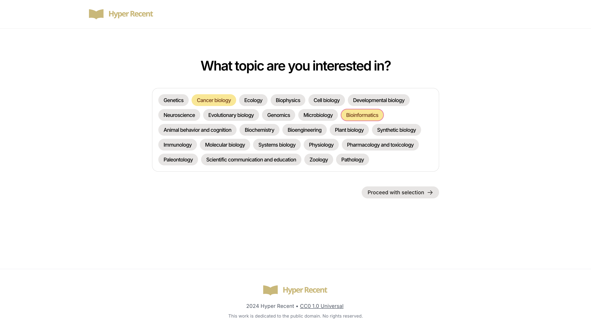
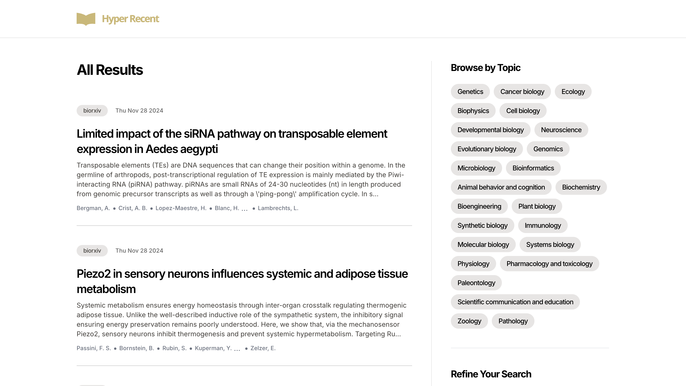
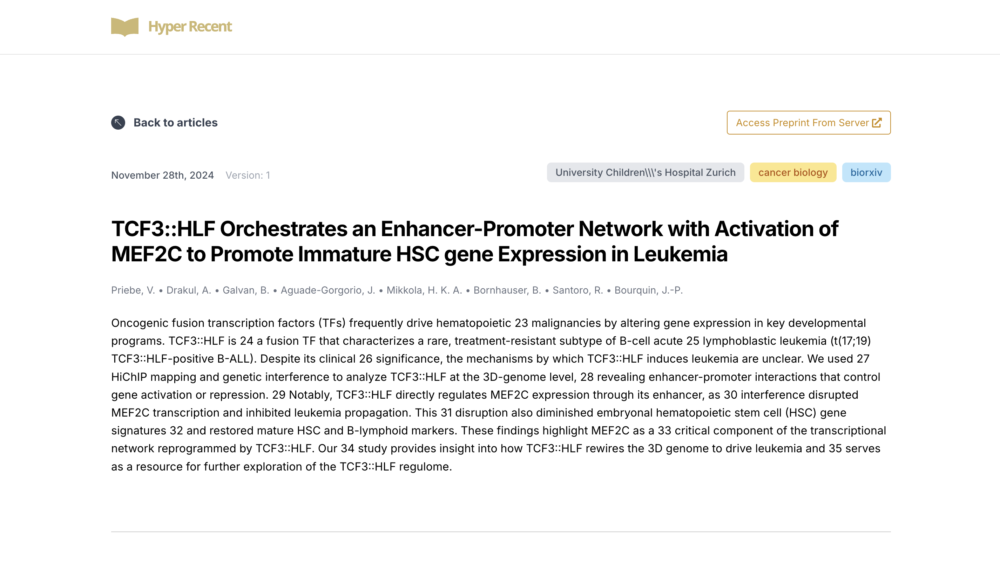
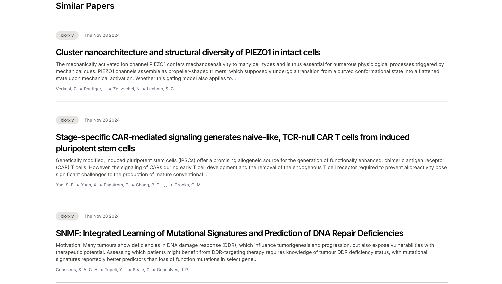
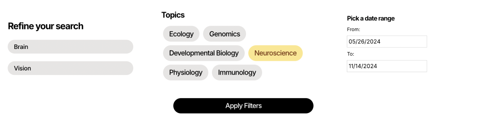
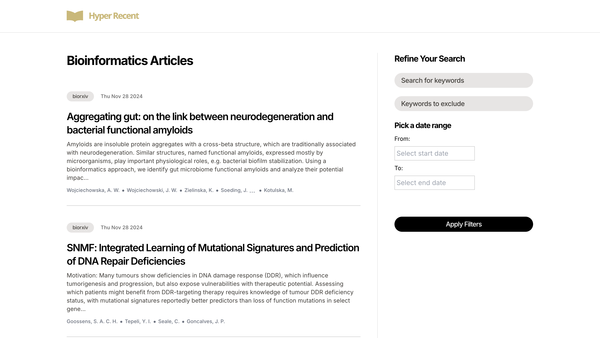
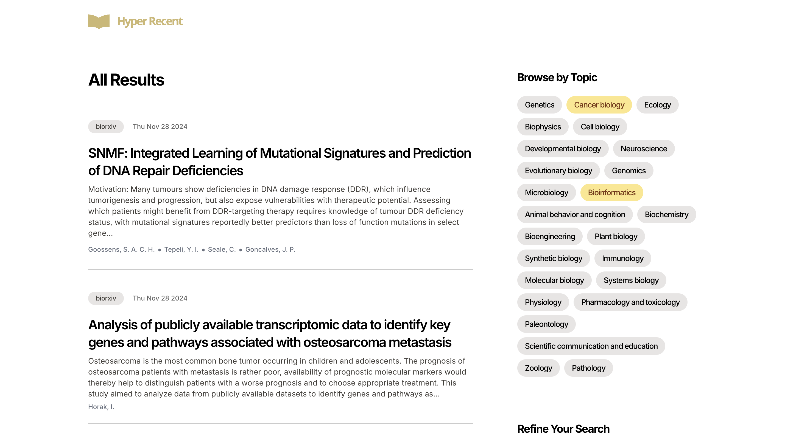
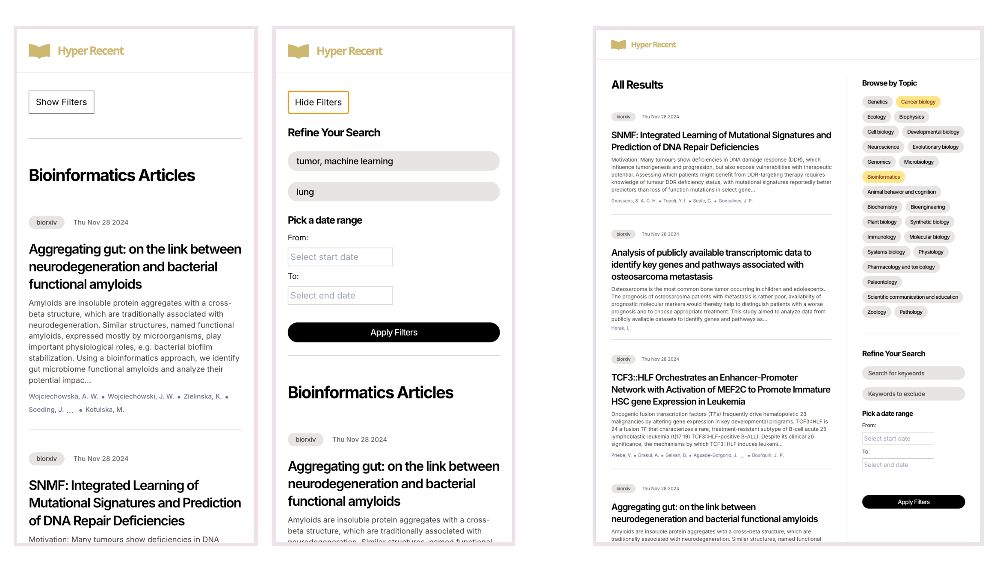

# Hyper Recent

[Hyper Recent](https://hyper-recent.online/) is a website designed to provide scientific researchers with access to the most recent and relevant papers, including pre-publication works. 

In collaboration with the [Bader Lab](https://baderlab.org/), we built a lightweight, user-friendly website that allows scientists to browse a personalized feed of the most recent papers. The feed can be customized by the user's selections, ensuring that they only see content that is relevant to their specific interests. Additionally, the website features topical searching for users to explore emerging research in specific topics, making it easier to stay updated on key developments in their field.

## Our Partner

 We are working with Professor and Principal Investigator Gary Bader (gary.bader@utoronto.ca) and Researcy Associate Jeffrey Wong (jvwong@gmail.com) at the [Bader Lab](https://baderlab.org/) within the Donnelly Centre for Cellular and Biomolecular Research at the University of Toronto. The Bader Lab is focused on advancing systems biology at the cell and tissue levels and developing computational methods to understand development, cancer as well as regenerative wound healing processes. In collaboration with the Bader Lab, we address the need for a lightweight, user-friendly platform that allows scientists to stay up-to-date with cutting-edge research in an efficient and accessible way.

## The Project

Hyper Recent is a user-friendly platform designed to provide researchers with immediate access to the most recent and relevant scientific papers, including pre-publication works. Built to address the challenges of delayed access to research, the platform curates a personalized feed of the latest publications, allowing users to explore articles based on specific topics of interest. Unlike traditional resources like PubMed, which suffer from review delays, or BioRxiv, which can be cluttered and difficult to navigate, Hyper Recent delivers a streamlined, focused experience.

The platform offers several key features to enhance usability and efficiency. Users can browse papers by topic, with advanced filtering options for keywords, date ranges, and exclusions to refine their search. Hyper Recent also remembers users' preferences, directing them to their chosen topics with each visit. In addition to offering quick access to pre-publication papers, the site provides a link back to the source article and recommends similar research, ensuring users stay up-to-date on the latest findings in their field. By combining speed, personalization, and ease of use, Hyper Recent helps researchers stay at the cutting edge of scientific discovery.

## Key Features

**1. Landing Page with Topic-Based Browsing**
- **Description**: The landing page introduces users to a variety of scientific topics, each acting as a gateway to a curated list of relevant publications. By selecting a topic, users can immediately access articles within their field of interest.
- **Value**: This feature streamlines content exploration by guiding users directly to areas they care about, minimizing irrelevant content. It aligns with our partner’s request to create a user-friendly, focused platform for biological publications.

    

**2. Caching User Preference**
- **Description**: When a user selects a topic from the landing page, this preference is cached in their browsing history. On their next visit, the user is directed straight to their previously selected topic, bypassing the landing page.
- **Value**: This feature enhances user convenience by eliminating the need to re-select a topic on each visit, automatically directing users to their preferred area of interest. This aligns with our partner’s goal of creating a lightweight, streamlined platform for staying updated with the latest publications.

**3. Recent Publications Display**
- **Description**: Upon choosing a topic, users see the latest publications for that field, sorted by publication date with the most recent articles at the top.
- **Value**: This feature enables users to stay current with new findings in their chosen fields, helping them easily follow recent advancements—a central aim of our platform in supporting research accessibility.

    

**4. Detailed Article Page**
- **Description**: Users can click on any article to view an article page, which includes details like category, author, publication date, version, abstract, and a direct link to the full article on bioRxiv. 
- **Value**: Researchers gain comprehensive insights into individual articles, along with recommendations to deepen their understanding of the topic, ensuring they have a convenient starting point for broader research.

    

**5. View Authors On Google Scholar**
- **Description**: Users can hover over an author’s name to access a direct link to their Google Scholar profile. This allows for quick access to the author’s work and citation metrics.
- **Value**: This feature facilitates deeper research by enabling users to explore the credibility and influence of authors and explore their related work.

**6. Access Preprint From Server**  
- **Description**: Each article page includes a prominent button that links directly to the full preprint on the original server, such as bioRxiv or medRxiv.  
- **Value**: This feature ensures users can seamlessly access the complete article, supporting detailed review and citation of the research while maintaining transparency and connection to the source. 

**7. Similar Articles Recommendation**
- **Description**: The article page features a list of similar articles based on the topic, publication date, and other attributes of the current article, allowing users to click through to related research seamlessly.
- **Value**: This recommendation feature supports continuous exploration, offering researchers additional resources in similar areas of interest and expanding their research network.

    
 

### Filtering Options

**8. Filter by Topic**  
- **Description**: Users can browse articles by selecting a topic from the provided range, directing them to a topic page displaying all recent publications in that field.  
- **Value**: The topic filter allows users to quickly narrow down the scope of publications to find publications most relevant to their specific research focus, enhancing the overall usability and relevance of the site.

    

**9. Filter by Multiple Topic**  
- **Description**: Users can select several topics from the main article page to explore several areas at once.  
- **Value**: The topic filter allows users to choose several topics at once, allowing for users to browse recent articles across their broader field of interest while still narrowing in on what they would like to see.

    

**10. Keyword Filtering within Topics**  
- **Description**: Within a selected topic, users can further refine results by entering specific keywords to display only articles containing those terms. This feature can also be used independently of topic selection.  
- **Value**: Targeted keyword search lets users hone in on articles that meet particular research criteria, addressing a core feature request from our partner by enabling more precise scope limitation.

**11. Keyword Exclusion**  
- **Description**: Users have the option to exclude specific keywords during filtering, effectively omitting unwanted publications containing those terms.  
- **Value**: This feature optimizes search results, helping users avoid irrelevant content and refine their focus on pertinent research.

**12. Date Range Filtering**  
- **Description**: Users can filter articles by specifying a start and end date, allowing them to view publications within a specific timeframe.  
- **Value**: This flexibility enables users to search within older publication windows or focus only on recent articles, meeting our partner's emphasis on recency.

**13. Combined Filtering**  
- **Description**: Users can apply multiple filters simultaneously for a highly customized search experience, such as selecting a topic (e.g., Neuroscience), specifying keywords (e.g., "brain"), setting date ranges, and excluding certain terms (e.g., "vision") all in a single search.  
- **Value**: The ability to combine filters allows for an efficient and highly specific search, enabling users to focus narrowly on the most relevant articles. This functionality aligns with our partner’s goal to create a streamlined, comprehensive platform for research exploration.

## Accessing Hyper Recent 

Try out Hyper Recent at https://hyper-recent.online/.

A video guide to using the website can be found [here](https://drive.google.com/file/d/1bHmART0RDn0_lK4jTWOf8Q_XFkih7Pz8/view?usp=sharing).

Hyper Recent is fully optimized for laptops, mobile devices, and smaller screens, ensuring seamless access to the platform from any device. The responsive design adapts dynamically to different screen sizes, allowing users to browse recent scientific publications conveniently on the go.

For information on how to access the development and user acceptance testing deployments or how to run Hyper Recent locally, reference the [README-Technical.md](./README-Technical.md).

## Licenses

This project is licensed under the [Creative Commons Corporation (CC0) License](https://creativecommons.org/publicdomain/zero/1.0/legalcode).
