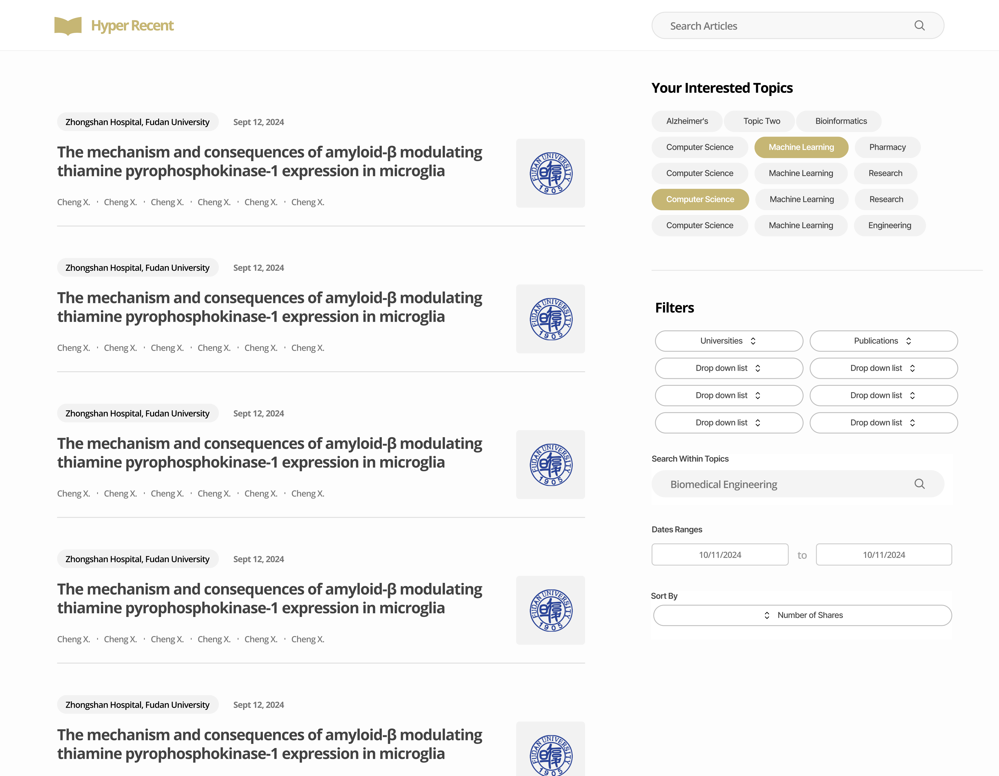
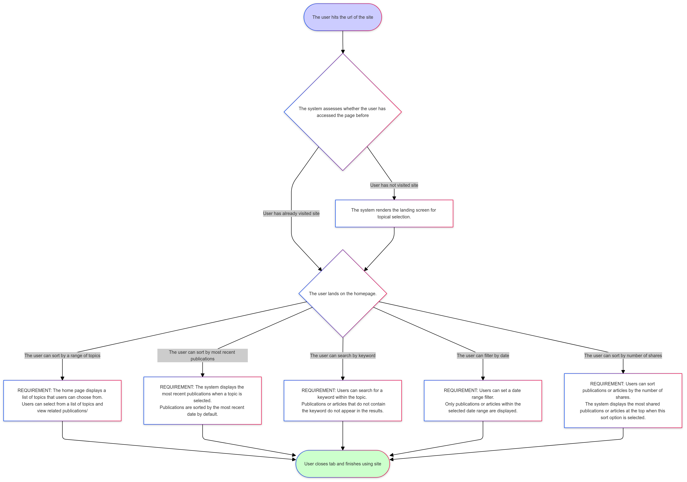
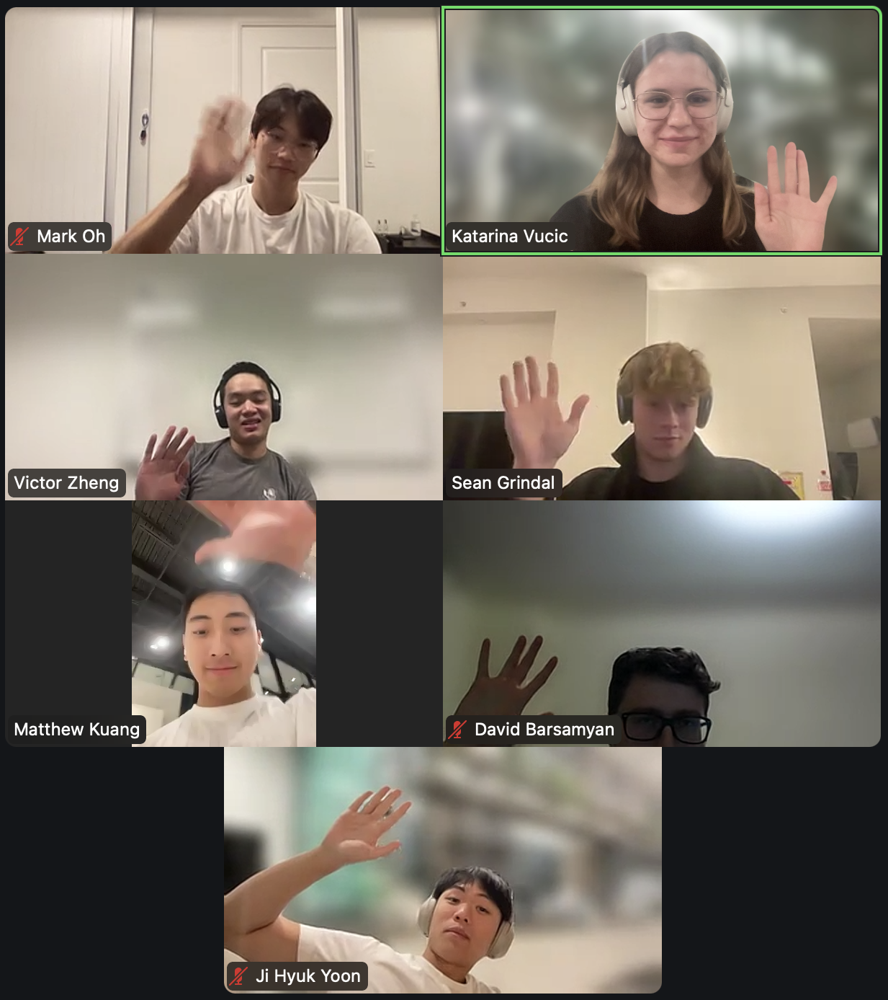
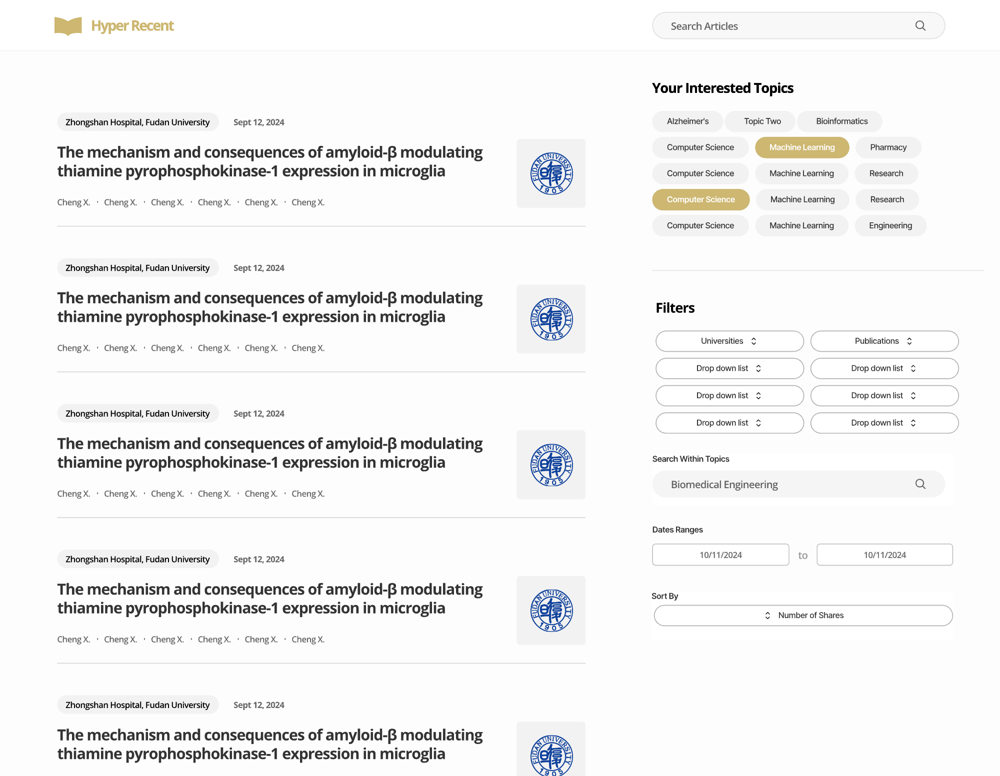
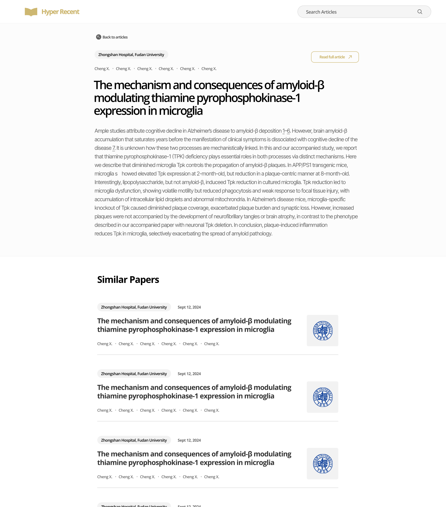

# Hyper-Recent/Looks Good to Me

## Product Details

Hyper-Recent is a **website** designed to provide biomedical researchers with a streamlined way to access the most recent and relevant scientific papers, including pre-publication works.

We are solving the problem of delayed access to up-to-date research, which is common in existing platforms like PubMed, where papers undergo lengthy review processes before publication. On the other hand, platforms like BioRxiv, while offering pre-published papers, are cluttered and difficult to navigate. Researchers need quick, reliable access to the latest findings without sifting through a sea of irrelevant content.

In collaboration with the Donnelly Centre for Cellular and Biomolecular Research, we are building a lightweight, user-friendly website that allows scientists to browse a personalized feed of the most recent papers. The feed can be customized by the user's selections, ensuring that they only see content that is relevant to their specific interests. Additionally, the website will feature topical sections for users to explore emerging research in areas like Alzheimer’s disease and Prion disease, making it easier to stay updated on key developments in their field.

Our goal is to offer a seamless experience for researchers who require instant access to cutting-edge scientific knowledge, reducing the wait time and improving the overall accessibility of important biomedical research.

### Built and designed for...

* Senior researchers working in universities or research institutes who are conducting studies, publishing papers, and staying updated on the latest advancements in their areas of expertise.
* Clinical professionals such as medical doctors or specialists who rely on the latest biomedical research to inform their practice and patient care.
* Biotechnology and pharmaceutical professionals who need quick access to cutting-edge research for drug development, medical devices, or other biotech innovations.
* Regulatory scientists working with agencies or institutions that require them to stay on top of new biomedical findings to inform policy decisions.

In general, **biomedical experts and researchers** who are already well-versed in their field.

### Scientists need a better search tool...

Nowadays, most scientists and researchers feel that current scientific literature archives are clunky and difficult to obtain the results they want. Oftentimes, search results using these existing tools produce broad and general results. Furthermore, many of these search tools emphasize the impact of a publication/article such that the top results are articles with the most citations or the most well known in the scientific community. On the contrary, our scientists and researchers want the complete opposite of all things mentioned. Experts in their field desire a lightweight, easy-to-use, search tool that allows them to browse the most recent literature contained in a narrow scope. Since this product emphasizes recency, experts will be able to stay up to date on the most recent developments in their field. 

### User Stories for the Minimum Viable Product

**User Story 1:** 
* As a user, I want to see and choose from a range of  topics on the home page in order to browse publications under a specific topic. 
* Acceptance Criteria:
  * [ ] The home page displays a list of topics that users can choose from.
  * [ ] Users can select a specific topic and view related publications.

**User Story 2:** 
* As a user, I want to see the most recent publications within a topic in order to stay up to date with the latest findings.
* Acceptance Criteria:
  * [ ] The system displays the most recent publications when a topic is selected.
  * [ ] Publications are sorted by the most recent date by default.

**User Story 3:** 
* As a user, I want to filter within topics by keyword in order to further narrow down the content I want to see.
* Acceptance Criteria:
  * [ ] Users can search for a keyword within the topic
  * [ ] Publications or articles that do not contain the keyword do not appear in the results

**User Story 4:** 
* As a user, I want to exclude specific publications or articles by keyword in order to find relevant publications faster by excluding irrelevant content.
* Acceptance Criteria:
  * [ ] Users can exclude keywords while filtering within topics.
  * [ ] Publications or articles containing the excluded keyword do not appear in the results.

**User Story 5:** 
* As a user, I want to filter by a specific date range in order to adjust the recency of the articles I want to read.
* Acceptance Criteria:
  * [ ] Users can set a date range filter.
  * [ ] Only publications or articles within the selected date range are displayed.

**User Story 6:** 
* As a user, I want to sort by the number of shares within a topic in order to see which articles are gaining traction in the scientific community.
* Acceptance Criteria:
  * [ ] Users can sort publications or articles by the number of shares.
  * [ ] The system displays the most shared publications or articles at the top when this sort option is selected.

The diagram above describes the workflows of the user. 

### Tech Stack and Deployment

The technology stack for the application includes a combination of modern JavaScript libraries and backend tools. The frontend will be built using JavaScript with React, which allows us to create reusable components across different screens. Redux will be used for state management, enabling centralized data management across various components. To handle data fetching, we will use a REST API. Additionally, Next.js will be implemented for server-side rendering, which improves performance by sending pre-rendered HTML to the client, making the website feel more lightweight and responsive.

On the backend, we are using Node.js and a PostgreSQL database. Since we are using a virtual machine, by using PostgreSQL, we can handle both the database and other backend services directly on the VM, streamlining management and reducing overhead. PostgreSQL also provides the flexibility we need to handle complex queries and relational data structures, offering more control within the same environment. We are also considering using Express.js to generate the APIs that will serve the frontend.

For CI/CD, we will employ YAML pipelines to automate testing, including unit and sanity tests, ensuring smooth and continuous delivery.

In terms of deployment, the application will be containerized using Docker. We will create a Docker Compose file that packages the application's dependencies and environment variables into a container, allowing for easy deployment across different machines. By SSH or RDP into virtual machines, we can deploy the Docker image and avoid the need for a dedicated hosting server. Additionally, the virtual machine will also host the database and handle SSL certificate generation.

We will be using third-party tools like Docker for containerization and Next.js for server-side rendering, as well as MongoDB for the database. Other APIs, such as those generated with Express.js, will facilitate communication between the frontend and backend.

----
## Intellectual Property Confidentiality Agreement 

The Partner said they are happy for us to choose the most, open, free methods for distribution and reuse. This includes providing the code on GitHub under a non-restrictive licence. They have used [Creative Commons Corporation (CCO) License](https://creativecommons.org/publicdomain/zero/1.0/legalcode) for projects before and proposed it for this project as well. 

----

## Teamwork Details

Team 17 met several times during the past couple of weeks to plan out the project. They have yet to meet in-person, but plan on organizing a couple of in-person meetings to have fun and work on the project together.

Team Fun Facts!
* Victor organized the 2024 Canadian Chess Championship.
* Mark and Jihyuk were enrolled in the Korean Military for 18 months.
* Katarina is a twin.

### Team Structure

Our team is comprised of 7 members split across 3 teams.

The teams include: 
* *Frontend Team*:
The frontend team is responsible for the development of the frontend of the project.
* *Backend Team*:
The backend team is responsible for the development of the backend of the project.
* *Product Team*:
The product team is responsible for monitoring the progress of the project to ensure the Mininimum Viable Product is met. They meet weekly with the Partner to provide updates and discuss concerns about the project.

The specific roles are:
* *Team Leader/Partner Liason*: 
The team leader will organize, attend, and lead team and partner meetings. They will be the first point of contact for the Partner and will relay information to the rest of the team. 
* *Product Manager*:
A product manager oversees the progress of the project and meets with the Partner. They create the adgenda for meetings, take notes during meetings, and upload the meeting minutes to the repository.
* *Frontend Dev Lead*: 
The frontend dev lead will oversee the progress of the Frontend, lead frontend team meetings, and assign the frontend work to members.
* *Backend Dev Lead*: 
The backend dev lead will oversee the progress of the backend, lead backend team meetings, and assign the backend work to members.
* *Backend Developer*:
A backend developer contributes to the development of the backend.
* *Frontend Developer*:
A frontend developer contributes to the development of the frontend.

The diagram above describes our team's project structure.

### Meet The Team 

#### Product Team

***Katarina Vucic***: Team Leader, Product Manager, Backend Developer:
* Katarina is a fourth year Bioinformatics and Computational Biology Specialist and Computer Science Major.
* Team Leader: Katarina has domain knowledge on the product from over a year doing bioinformatics research. She learned Agile and led SCRUM meetings at her Machine Learning internship this summer. She currently manages 130 volunteers as the Volunteer Relations Co-Director at Caffiends, a student-run cafe on the UofT campus. She would like to use this opportunity to perfect her presentation skills become more comfortable communicating with different audiences.
* Product Manager: Katarina organized, documented, and presented an 8-month research project, where she learned how to plan and execute projects independently.
* Backend Developer: Katarina worked with GCP BigQuery to store and query massive amounts of data at her Machine Learning internship this summer. She would like to take this course as an opportunity to design a database herself and learn JavaScript frameworks like Node.js.

***Ji Hyuk Yoon***: Product Manager, Frontend Developer:
* Jihyuk is a third year Computer Science Specialist. 
* Product Manager: Although Jihyuk does not have direct experiences with being a Product Manager, Jihyuk was a unit leader for 10 months during 18 months of his military service, and experienced organizing deadlines and documenting progress to report to the officers at the base. 
* Frontend Developer: Jihyuk worked ata startup called Ensighter group as a part time intern migrating their purely HTML website to React and JS, and worked with React Native to help build the mobile application as the frontend team. Jihyuk has experience with working with Next.js and Redux as well from this work term. 

#### Backend Team

***Victor Zheng***: Backend Dev Lead, Backend Developer:
* Victor is a third year Computer Science Specialist
* Backend Dev Lead: Victor has experience with developing and deploying enterprise applications in professional experiences. He is currently working part-time as a Systems Engineer at the Government of Ontario. He has experience with backend and infrastructure technologies such as Oracle, Postgres, IIS, Azure, .NET, node.js, Docker, APIs, etc. He hopes to develop his skills as a team leader working with other developers and to become a more rounded engineer.

***Taewoong (Mark) Oh***: Backend Developer:
* Mark is a third year Computer Science Specialist.
* Backend Developer: Mark has worked with Node.js and MongoDB to store and query data in various side projects. He would like to utilize his learnings from his side project and take this course as an opportunity to apply his learnings at a larger scale. He also hopes to hone his knowledge in database and servers, and learn to create more organized and structured backend service.

#### Frontend Team 

***Sean Grindal***: Frontend Dev Lead, Frontend Developer:
* Sean is a fourth year Computer Science Specialist
* Frontend Dev Lead: Sean has extensive experience working on different frontend projects from static websites to large fullstack applications. He has worked part-time in multiple frontend positions at various different companies for 3+ years and has experience with multiple web frameworks and technologies such as React, Vue, Next.js, Node.js, Vercel, Firebase, Unit Testing, SCSS, Tailwind, etc. He hopes to develop his skills as a team leader working with other developers and rapidly evolving codebase.

***David Barsamyan***: Frontend Developer:
* David is a fourth year Computer Science Specialist.
* Frontend Developer: David has experience with frontend development through university coursework and also other web development side projects. He has worked with HTML, CSS, JavaScript, jQuery and React for frontend and Python + Django for backend. He also has experience with relational databases from coursework and side projects. He wants to apply these skills he has learned by creating a functional frontend for the web project. He also wants to further develop his skills in frontend development by learning to use new tools and frameworks such as Next.js.

***Matthew Kuang***: Frontend Developer:
* Matthew is a third year Computer Science Specialist.
* Frontend Developer: Matthew has no professional experience developing frontend, but has worked on frontend in coursework and side projects. He has worked with HTML and CSS, and learned JavaScript over the summer. He wants to further develop his skills in a real project and take the opportunity to apply what he has learned by creating a functional and fluid frontend experience.

### Meetings

Meetings will occur over Zoom weekly. The following meetings will be scheduled:
* *Team meeting*: during tutorial time, from 8:00-8:45pm. This weekly sync meeting will allow the team to provide updates and address any concerns they may have.
* *Backend meeting*: date to be determined. This weekly meeting is for the backend team to discuss their progress and plan their week.
* *Frontend meeting*: date to be determined. This weekly meeting is for the frontend team to discuss their progress and plan their week.
* *Product meeting*: date to be determined. This weekly meeting is with the Partner and product team, to provide updates and address any concerns the Partner may have.

All meetings will have a product manager to take meeting minutes on what was discussed for other team members to reference. Recordings for select meetings will also be uploaded to the Google Drive.

### Communication
 
**Slack** is the primary form of communication for the project.  Team members must check in once a week at a minimum, and acknowledge that they have read announcements by using a reaction on Slack. 

**Zoom** will be used for meetings, some meetings will be recorded, and meeting minutes will be transcribed for all meetings. Team members are expected to attend relevant meetings and provide an explanation if they cannot make it.

Additionally, there is an optional **Google Calendar** set up with deadlines and meeting times scheduled in for those who use Google Calendar.

Communication with the Partner will occur through Slack. Additionally, the Partner can contact the Team Lead through email. 

### Code Monitoring

**GitHub Issues** will be set up and used for ticketing once we start development. Tasks will be broken down into smaller tickets of work that can be given labels and assigned with priority and time in mind. Tasks get assigned to team members based on their roles by the Tech Leads. Team members with manager roles will get less coding tickets assigned to them, to compensate for their time spent on admin.

All code associated with an Issue will have its own branch to track changes. Standard branch naming conventions will be used along with GitHub labels. All branches must be approved by a minimum of one person (other than the owner) for the merge request to be merged.

GitHub Issues was chosen specifically so that the Partner will be able to reference the development process for future maintainability. 

### Collaboration

Team members are expected to attend meetings for the teams they are a part of. If they are unable to attend due to a scheduling conflict, they should let the team know as soon as possible to arrange for an alternate time. 

The team acknowledges that all members are taking on a heavy courseload and may have weeks where they are busier than others. Team members are expected to inform the team of weeks when they will not be able to fully commit to the project, so that adjustments can be made to the schedule to ensure everything gets done on time. Adjustments include setting earlier deadlines for things to be completed or the team member putting in more time prior to their busy week.

A team member is considered unresponsive if they have not contributed in Slack, meetings, or code for 1 week. In this event, the Team Leader will reach out to the team member to see what needs to be done to get them back on track. If the team member does not respond within 3 days, or they respond but do not contribute for 1 week, the TA will be contacted. 

## Organisation Details

### Team 17 Within the Bader Lab

Professor Gary Bader is the head scientist at the Bader Lab, part of the Donnelly Centre for Cellular and Biomolecular Research. His lab focuses on systems biology at the cell and tissue levels, consistently making innovative contributions to precision medicine and network and pathway analysis. Within the lab, there are distinct groups, one of which focuses on developing software tools to support biological research, including web tools such as GeneMANIA, which generates DNA model predictions, and Topical, a platform that curates research data by topics in biology.

Our team fits into the Bader Lab's structure as a dedicated software development group tasked with building a new website to curate scientific publications in the biomedical field. The goal of this project is to make biological research knowledge more open, accessible, and reusable. This aligns with the broader mission of the Bader Lab, which aims to provide cutting-edge tools that support biomedical researchers. By developing this website, we directly support the research teams within the lab, particularly those focused on staying current with the rapidly growing volume of scientific literature.

Our role will primarily be in product development. Although there is an existing prototype codebase, our team will essentially be building the product from the ground up. This will involve developing new features and enhancing the user interface to make the website more intuitive and responsive. Key features we plan to implement include automatic updates of article metadata, real-time search and filtering capabilities, and an interface that allows users to quickly access recent publications. Our primary users will be researchers and students in the biomedical field, so the user experience will need to focus on simplicity and speed, addressing the challenge of keeping up with the overwhelming rate of new scientific discoveries.

Our team is uniquely equipped to take on this role. We have members with strong backend development skills who can build a scalable and reliable backend to support the volume of research articles and queries that will be handled by the site. We also have members with significant experience in frontend development, allowing us to create a user-friendly interface that integrates seamlessly with the backend. Additionally, some team members have a background or strong interest in computational biology, which will help us understand the needs of the target users.

An important factor that makes us a good fit for this role is our fresh perspective. As we are not deeply embedded in biological research, we bring a different approach to designing and developing the product. In a meeting with Jeffrey Wong, a scientist at the Bader Lab with a decade of experience in computational biology and software development, he emphasized that people within the field tend to develop products based on familiar patterns, which can limit innovation. By not being entrenched in those patterns, our team is positioned to bring a new, creative approach to the design of this product. Jeffrey also mentioned that he doesn’t want to provide too much guidance on the development process, to avoid influencing our decision-making and UI implementation too much. This gives us the freedom to explore different possibilities and potentially create something truly innovative.

### Hyper-Recent Within the Bader Lab

Hyper-Recent aligns directly with the overall goal of the lab and its other products such as GeneMANIA, Pathway Commons, Cytoscape, which are all software developed by the lab to make biological pathways and network data easily visualized, and accessible to researchers.

As our project does have a prototype, we could say that there is some basis to build from, but as this is simply a prototype, we see the our project as the first step towards building this project, and take the prototype as a guideline in the sort of product we should aim to develop and expand on. We will be developing the front end and the back end of the product with a server and a database. The scope of our project will be decided by the team, meaning, we will be proactively brainstorming core features and implementing them too.

Currently, with the team having different specialties, we plan to have Victor working as the backend lead, and Sean leading front end, with Mark and Katarina working as backend devs, and Jihyuk, Matthew and David working on the front end. Katarina nad Victor will be Product Manager/Team Lead. These roles are in place for organisation and division of labour, however are flexible under circumstances, thus, by demand, backend developers could help frontend vice versa. Currently there are no plans as to help from the lab in developing the product, but Jeffrey Wong (Scientist from Bader Lab) will be providing feedback for the product.

## Potential Risks

### Meeting the partner’s demand for a low-maintenance product after we leave.
  * The partner expressed during our meetings that they prefer a product simple enough to require little to no maintenance after our involvement with the project ends. To meet this requirement, they suggested using straightforward code and avoiding complex frameworks, as bio researchers may find it challenging to manage the software if it becomes too complicated. However, this request would create difficulties when implementing more complex user stories, which could require the use of more advanced frameworks and tools.
  * **Mitigation Strategy:** Increasing communication with the partner to find a balance between meeting the project's complex requirements while ensuring low-maintenance after completion. This could involve proposing solutions that maintain simplicity where possible, while also providing comprehensive and detailed documentation on the necessary complex features to make the maintenance easier in the future.
### Changes to user stories by the partner, leading to increased complexity or misalignment with the initial requirements.
  * During initial discussions with the partner, several aspects of the project were left open-ended, allowing us to interpret and define certain user stories ourselves. As a result, some early user stories may appear simplistic or lack detail. A potential risk arises if, later in the project, the partner provides more specific directions or requests more complex user stories that contradict or go beyond what we have already implemented. Since we are not required to revise or add new advanced user stories after the project scope is agreed upon, this could lead to a conflict with the partner if expectations shift mid-project.
  * **Mitigation Strategy:** We can add more detailed descriptions to make the user stories less abstract and vague. This should reduce the likelihood of future contradictions. Additionally, maintaining open communication with the partner and addressing any disagreements early on will help ensure that the user stories are aligned with the project's goals from the start.
### Potential price issues with server and AI API cost.
  * While we plan to use cost-effective solutions server hosting online or university virtual machines, there is still a risk of unexpected price increases or limitations in the resources provided. For instance, costs may rise with increased usage, or the university’s virtual machines might lack the necessary capacity for future demands. Additionally, we might need to integrate a generative AI API for certain tasks, which could introduce further costs based on the volume of prompts. These factors could lead to higher operational expenses or performance issues, impacting the long-term viability of the project.
  * **Mitigation Strategy:** Discuss with the partner to explore potential funding options and also to get a clearer understanding of the project's scope, which will help identify any anticipated additional costs. Also, clarify the specific user stories to better understand the extent of generative AI integration needed, allowing for a more accurate estimation of the required costs.
### Partner's software expert is absent, which may cause delays and misalignment.
  * The software expert who works alongside our partner has been absent from our meetings, which has made it difficult to address and clarify important technical details. In the future, this lack of input could slow down development, lead to delays and misunderstandings about the implementation of key features, which may ultimately prevent us from fully meeting the partner's expectations.
  * **Mitigation Strategy:** To mitigate the impact of the software expert’s absence, we could ask if there is another technical person we can contact in case we encounter issues with our tech stack. If that’s not possible, we could establish clear written channels through Slack or email, for technical clarifications and decisions. This ensures that any technical issues are well documented, and progress can continue without any delays.
 

-----

### Mockup

Mockups were designed on Figma.

Full mockups: [here](diagrams/wireframe-mockups.pdf)

Model of how our page would look like. 
