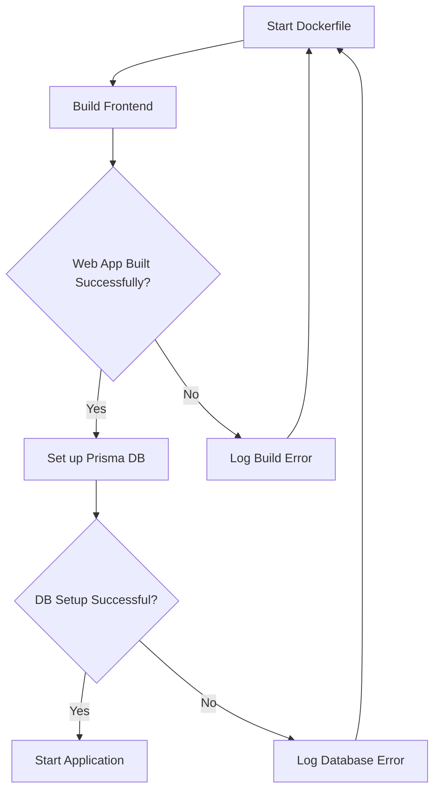

```mermaid
flowchart TD
    A[Start Dockerfile] --> D[Build Frontend]
    
    D --> F{Web App Built Successfully?}
    F -->|Yes| G[Set up Prisma DB]
    F -->|No| H[Log Build Error]
    
    G --> I{DB Setup Successful?}
    I -->|Yes| J[Start Application]
    I -->|No| K[Log Database Error]
    
    H --> A
    K --> A
```