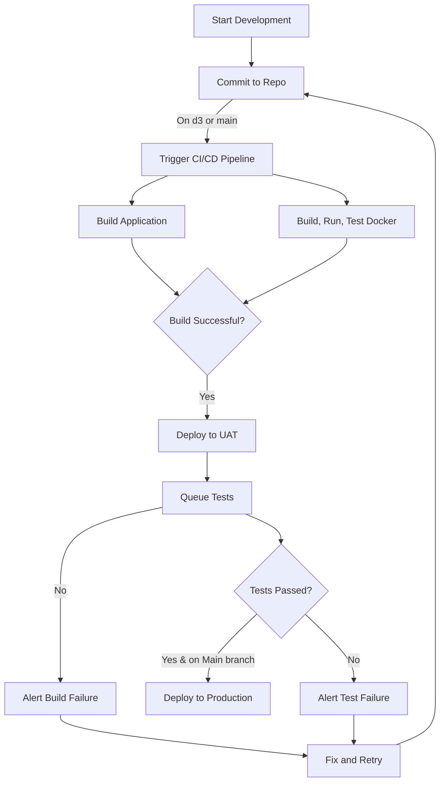

```mermaid
flowchart TD
    A[Start Development] --> B[Commit to Repo]
    B --> |On d3 or main| C[Trigger CI/CD Pipeline]
    C --> D[Build Application]
    D --> E{Build Successful?}
    E -->|Yes| F[Deploy to UAT]
    F --> Y[Queue Tests]
    Y -->|No| G[Alert Build Failure]
    Y --> H{Tests Passed?}
    C --> M[Build, Run, Test Docker]
    H -->|Yes & on Main branch| I[Deploy to Production]
    H -->|No| J[Alert Test Failure]
    G --> N[Fix and Retry]
    J --> N
    N --> B
    M --> E
```
